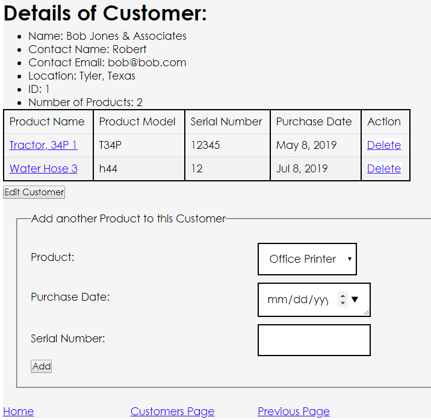

# Products and Customers

Products and Customers is a simple web application that manages the products a vendor or distributor has under use by customers, and also manages the customers using those products

# Installation
This is a Maven/Spring Boot project with default WAR settings

Spring Boot will populate your MySQL file.  Just create the file and if different, change in the application.properties file

[comment]: # (mvn spring-boot:run)

# Usage

Vendors/distributors can track their customers by product, and product by customers.  

To start, in the Product side, add the various products that are in use.  Fields are:  
  * Name
  * Model
  * List Price
  * Description

Next, on the Customer side, add the various customers.  Fields are:
  * Name (Corporate)
  * Contact Name
  * Contact Email
  * Location

Next, the relationship between customers and products can be populated on either side.  This shows which customers hava a product and which products are in use by a customer.  These fields are:
  * Purchase Date
  * Serial Number
Note:  this means that adding or deleting a product to/from a customer also means that customer was added or deleted to/from that product

## API Documentation
Note:  all use content-type:  application/json & Media-type:  JSON

RU for Vendor...this is the entity that owns the products and the customers being tracked:
* Fetch  Vendor info
  *   GET  api/vendor  Note;  did not specify vendor as there is always only one
* Update Vendor info
  *   PUT api/vendor  

CRUD for Customers:
* Add a customer
  *  Post api/customers
* Fetch all customers
  * GET  api/customers
* Fetch all customers of product {id} showing only customers
  * GET api/customers/products/{id}
* Fetch all products for customer {id}
  * GET api/customers/{id}/products
* Fetch customer {id}
  * GET api/customers/{id}
* Update customer {id}
  * PUT   api/customers/{id}
* Delete customer {id}
  * DELETE  api/customers/{id}

CRUD for middle/Join table of Customers-Products
* Add product {prodId} to customer {custId}, Note:  also adds customer {custId} to product {prodId}
  * POST  /api/customers/{custId}/products/{prodId}
    * OR
  * POST /api/products/{prodId}/customers/{custId}
* Delete product {prodId} from customer {custId}
  * DELETE api/customers/{custId}/products/{prodId}
    * OR
  * DELETE api/products/{prodId}/customers/{custId}

CRUD for Products:
* Add a product
  * POST api/products
* Fetch all products
  * GET api/products
* Fetch all products of customer {id} showing only products
    * GET api/products/customers/{id}
* Fetch all customers for product {id} with product showing
    * GET api/products/{id}/customers 
* Fetch product,  {id}
    * GET api/products/{id}
* Update product {id}
    * PUT api/products/{id}
* Delete product {id}
    * DELETE api/products/{id}

OtherP
* Does Customer have this product/check to see if product {prodId} to customer {custId} exists
    * GET api/customers/{custId}/products/{prodId}
* Fetch number of customers
    * GET api/customers-customers-number-of
* Fetch list of customer IDs
    * GET api/customer-ids
* Check validity of customer id; returns true or false
    *GET api/customers-id/{id}
* Fetch number of products
    * GET api/products-number-of
* Fetch list of product IDs
    * GET api/product-ids
* Check validity of product id; returns true or false
    * GET api/products-id/{id}

## Selected JSP Screenshots:

  
  
  
  
  
  

# Potential Future Features:

  * Added form input flexibility
  * Search, sort, or pagination to accommodate long lists

